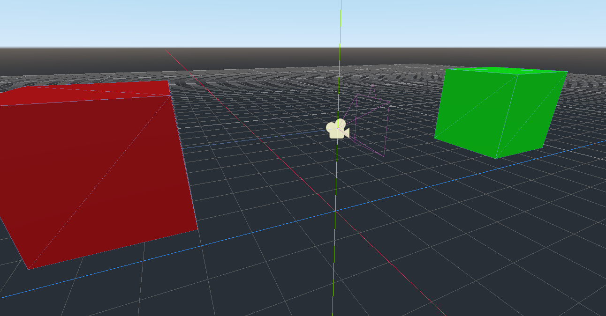

# SpringArm demo

# Instructions
1. Donwload the zip or use `git clone` to download the project
2. Extract if necessary, then use Godot import to select the `project.godot` file.
3. Run `Main.tscn`

Press `Esc` to toggle the red cube's collision shape.
